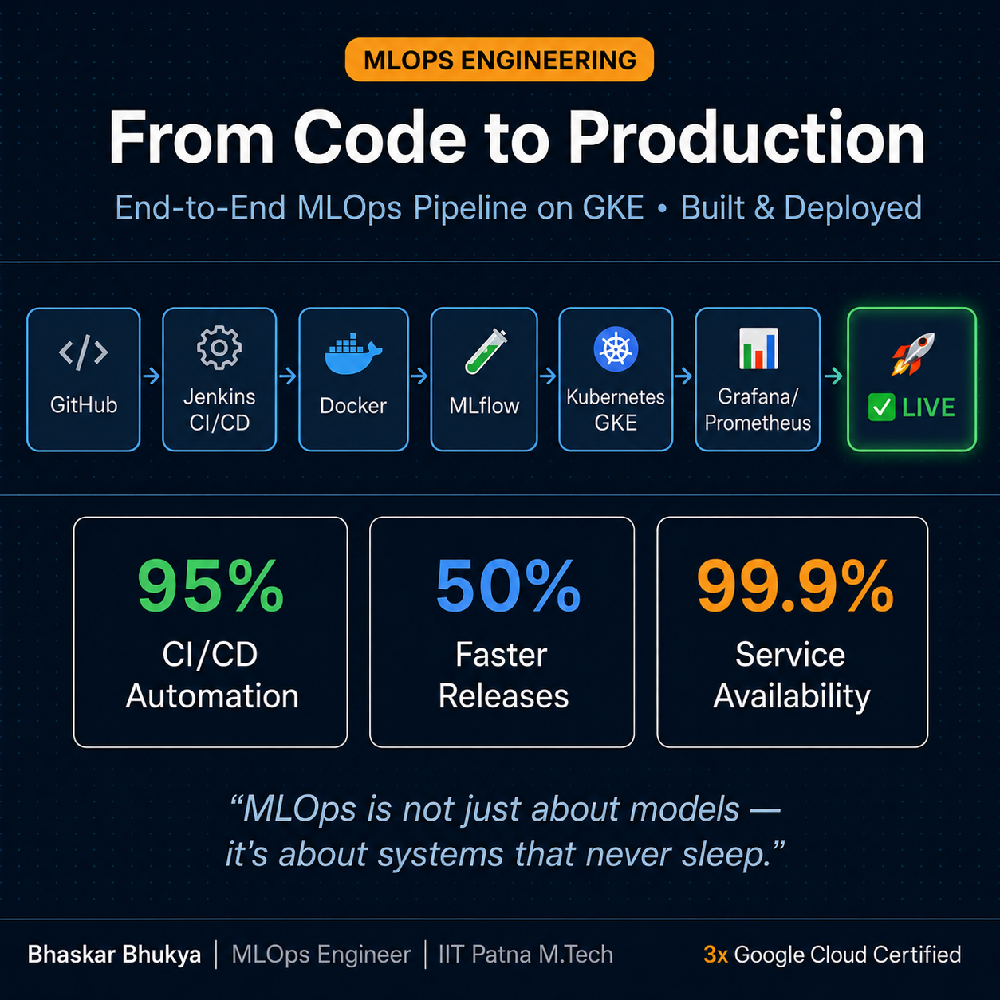

# End-to-End MLOps Pipeline


# 🚀 End-to-End MLOps Pipeline: Loan Risk Prediction

An enterprise-grade, fully automated Machine Learning Operations (MLOps) pipeline. This project trains a predictive model, containerizes the serving API, and deploys it to a production Kubernetes cluster via a Jenkins CI/CD pipeline.

## 🏗️ Architecture & Tech Stack
* **Machine Learning:** Scikit-Learn, Pandas
* **Experiment Tracking:** MLflow
* **API Framework:** FastAPI, Uvicorn
* **Database:** PostgreSQL
* **Containerization:** Docker
* **Cloud Infrastructure:** Google Cloud Platform (GCP)
* **Container Registry:** Google Artifact Registry
* **Orchestration:** Google Kubernetes Engine (GKE) Autopilot
* **CI/CD Automation:** Jenkins, GitHub Webhooks

---

## 🧠 Project Lifecycle Overview

1. **Model Training & Tracking:** Python scripts train the loan prediction model. MLflow tracks metrics (accuracy), parameters, and artifacts locally.
2. **Containerization:** The FastAPI application and model are packaged into a lightweight Docker image.
3. **Infrastructure Provisioning:** A highly available GKE Autopilot cluster is spun up in GCP (`asia-south1`).
4. **Continuous Integration/Continuous Deployment (CI/CD):** * Code pushed to GitHub triggers a Jenkins pipeline.
   * Jenkins checks out the code, builds the Docker image, and securely authenticates with GCP using direct access tokens.
   * The image is pushed to Google Artifact Registry.
   * Jenkins dynamically updates the Kubernetes `deployment.yaml` and applies the rollout to the GKE cluster with zero downtime.

---

## 🛠️ Step-by-Step Setup Guide (For Future Reference)

### 1. Local Development
Create a virtual environment and install dependencies:
```bash
python3 -m venv venv
source venv/bin/activate
pip install -r requirements.txt
```

Set up your `.env` file for local PostgreSQL access:
```env
DB_USER=postgres
DB_PASSWORD=yourpassword
DB_HOST=localhost # Change to host.docker.internal when using Docker on Mac
DB_PORT=5432
DB_NAME=postgres
```

Run the FastAPI server locally:
```bash
uvicorn main:app --reload
```

### 2. Docker & GCP Authentication (Mac Apple Silicon Bypass)
If using Docker Desktop on a Mac, standard `gcloud` authentication can fail. Use this token bypass method to log in to the Artifact Registry:
```bash
# Get token and feed directly to Docker
gcloud auth print-access-token | docker login -u oauth2accesstoken --password-stdin [https://asia-south1-docker.pkg.dev](https://asia-south1-docker.pkg.dev)
```

### 3. Deploying to Kubernetes (Manual)
If you need to deploy manually without Jenkins, connect to the cluster and apply the manifest:
```bash
# Get cluster credentials
gcloud container clusters get-credentials mlops-prod-cluster --region asia-south1 --project loan-mlops-gke

# Apply deployment and service
kubectl apply -f deployment.yaml

# Watch for your public LoadBalancer IP
kubectl get services
```

### 4. Jenkins CI/CD Configuration Notes
If Jenkins is running locally on a Mac, it runs in a headless environment and will not read your `~/.zshrc` file. You **must** inject your system paths directly into the `Jenkinsfile` environment block so Jenkins can find `docker` and `gcloud`:
```groovy
environment {
    PATH = "/Users/YOUR_USER/google-cloud-sdk/bin:/opt/homebrew/bin:/usr/local/bin:/usr/bin:/bin:${env.PATH}"
}
```

---

## 🚨 Troubleshooting Cheat Sheet
* **`zsh: command not found: gcloud`**: Run `source ~/google-cloud-sdk/path.zsh.inc`.
* **Docker Unauthenticated Error**: Run the `gcloud auth print-access-token` bypass command above.
* **Kubernetes Auth Plugin Error**: Run `gcloud components install gke-gcloud-auth-plugin`.
* **Git accidentally tracked massive folders (`venv`)**: Create a `.gitignore`, then run `git rm -r --cached .` and re-add the files.
```
